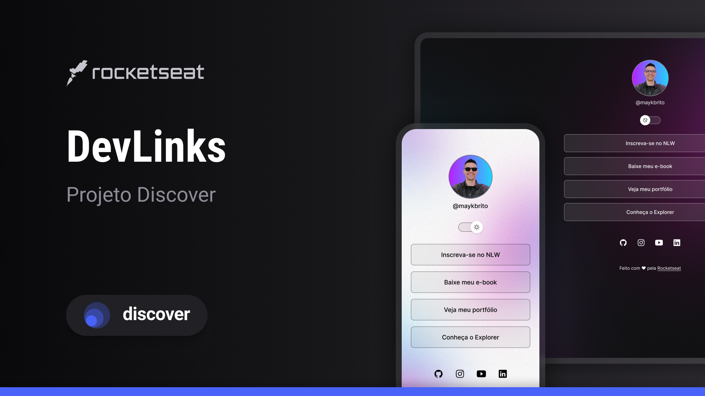

<h1 align="center"> Link Para Bio </h1>

Projeto criado no estilo do Linktree (link para colocar na bio das redes sociais) com o mesmo objetivo.

  <a href="#-tecnologias">Tecnologias</a>&nbsp;&nbsp;&nbsp;|&nbsp;&nbsp;&nbsp;
  <a href="#-projeto">Projeto</a>&nbsp;&nbsp;&nbsp;|&nbsp;&nbsp;&nbsp;
  <a href="#-layout">Layout</a>&nbsp;&nbsp;&nbsp;|&nbsp;&nbsp;&nbsp;
  <a href="#memo-licença">Licença</a>

  

 

  

## 🚀 Tecnologias

Esse projeto foi desenvolvido com as seguintes tecnologias:

- HTML e CSS
- JavaScript
- Git e Github
- Figma

## 💻 Projeto

O Link Para Bio é um agregador de links para utilizar como cartão de visita online. Acesse o projeto [AQUI](https://yuriverwiebe.github.io/projeto-links)

## 🔖 Layout

Você pode visualizar o layout do projeto através [DESSE LINK](https://www.figma.com/file/YN7EU9VQKOspoMfT6cWhum/DevLinks-%E2%80%A2-Projeto-Discover-(Community)?type=design&node-id=10-620&mode=design&t=KfqN0ogCdLrNK86B-0). É necessário ter conta no [Figma](https://figma.com) para acessá-lo.

## 📝 Licença

Esse projeto está sob a licença MIT.

---

Feito com ♥ by Yuri Verwiebe No programa Discover da RocketSeat 🌊 [Participe da comunidade RocketSeat!](https://discord.gg/rocketseat)
